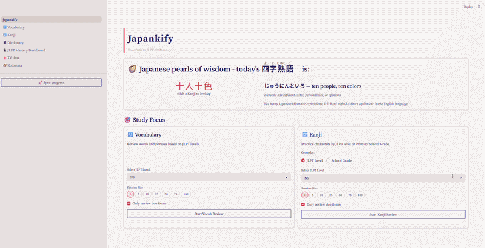
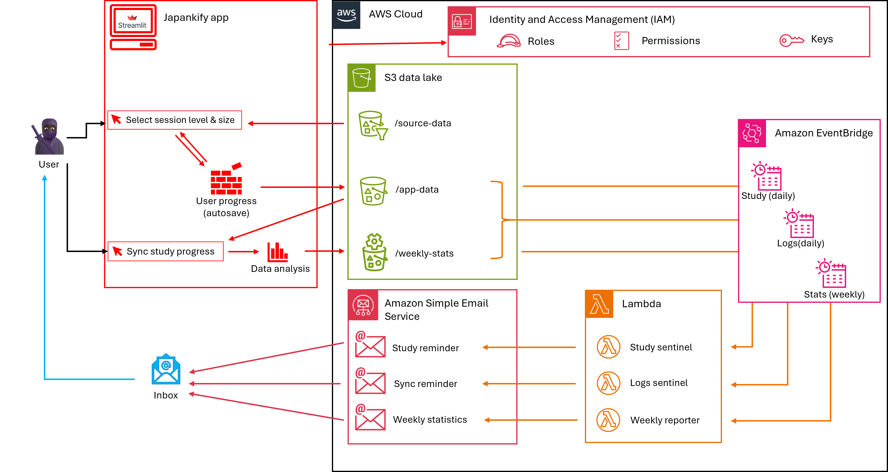
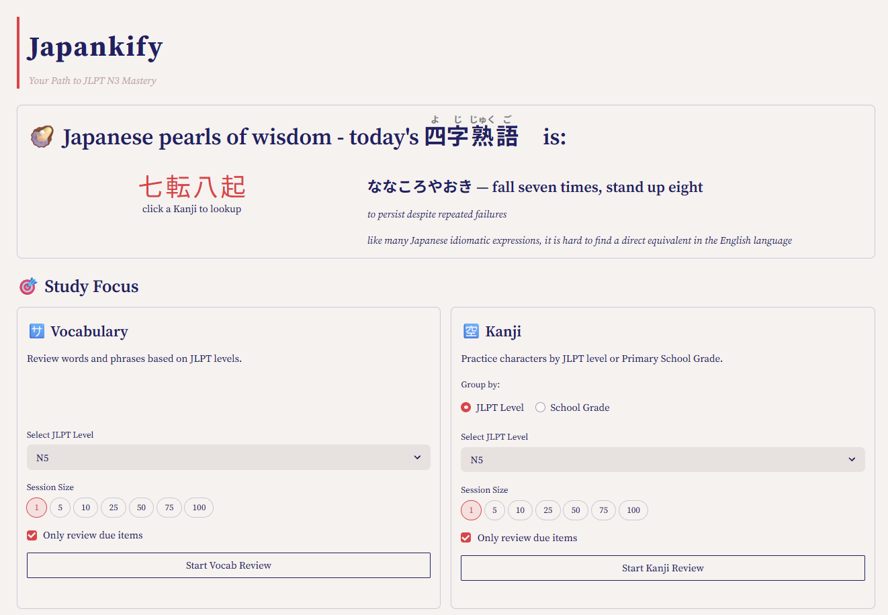
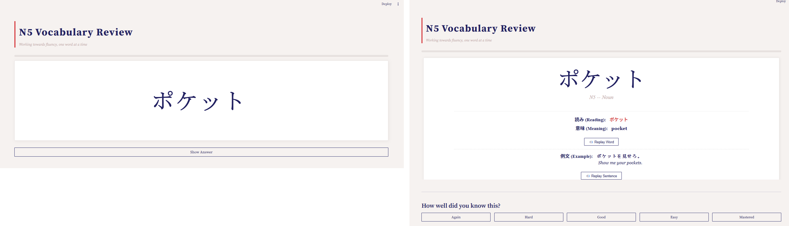
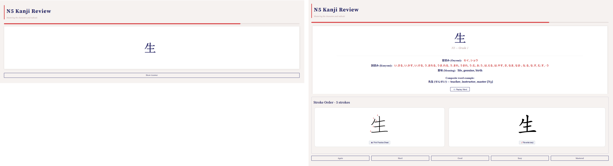
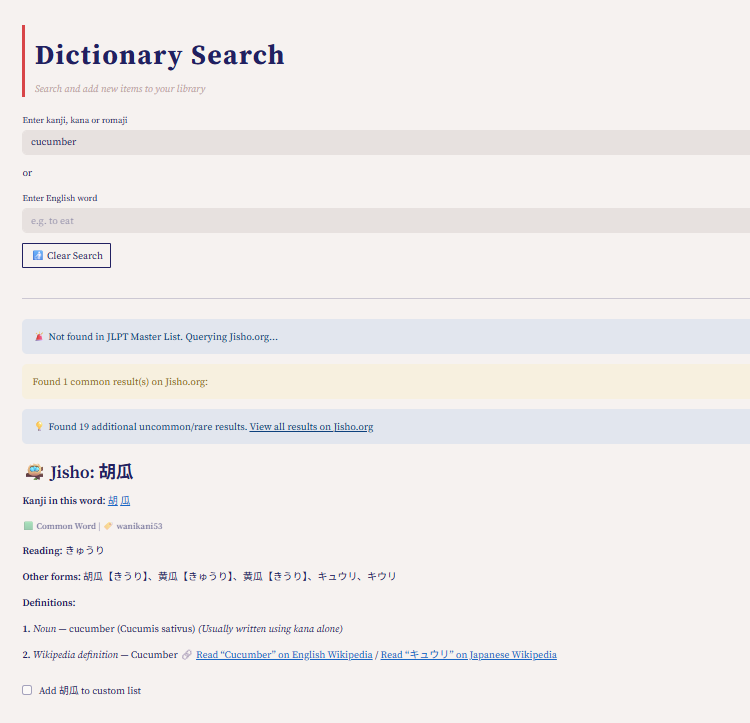
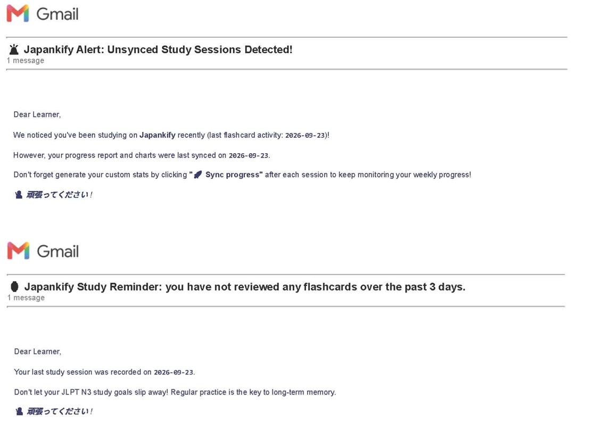
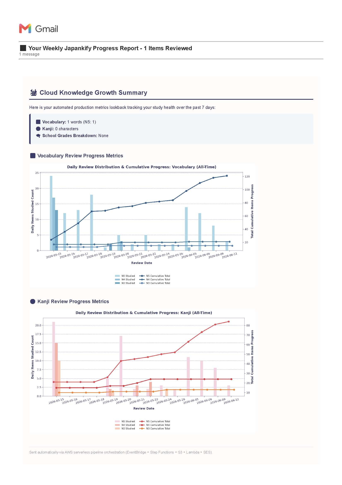

# 🥷 Japankify

> *An SRS-based Japanese vocabulary & kanji learning and analytics application built for JLPT learners.*

---


### 🚀 [Demo version available on Streamlit Community Cloud](https://japankify-demo.streamlit.app/) 


<p align="center">
  <br>
  <em>A quick kanji review</em>
</p>

---

## 📌 Project Outline

**Japankify** was originally built as an alternative to online, subscription-based Japanese flashcards apps and other kanji-cramming websites. Targeted primarily at intermediate learners wanting to take less of a Stakhanovite approach with their learning endeavours, *Japankify* aims at bridging the gap between raw SRS logic and actionable data-driven insights, while offering a user-friendly and interactive interface and an evolutive UI capable of supporting their learning journey beyond their current targeted level.

* **Release Version (JLPT N3):** Tailored explicitly for intermediate JLPT N3 learners. The curated master JLPT datasets (N5 to N1 levels) are available on Kaggle ([vocabulary](https://www.kaggle.com/datasets/celineboutinon/jlpt-master-vocabulary-library-n5-n1) and [kanji](https://www.kaggle.com/datasets/celineboutinon/jlpt-master-kanji-library-n5-n1)) to facilitate deployment and testing, as well as "seed" personal wordbanks (see [Datasets](#-datasets) below).

* **Full-Spectrum Scalability (N5 to N1):** The underlying architecture is completely decoupled from hardcoded vocabulary and kanji lists; it can effortlessly scale up to **JLPT N1** or down to beginner tiers, making it a flexible, modular Japanese learning tool for students at all levels.

* **Multi-Page Layout & Neutral Colorscheme:** Designed with a custom color palette and logical separation of study topics across 6 dedicated pages, *Japankify* delivers a clean, uncluttered user experience optimized to avoid distractions and minimize eye strain during extended study sessions.

---

## 📌 Repository Structure

```text
japankify-open/
├── main branch                          # Production-ready codebase for local user deployment
│      ├── japankify.py                  # Main entry point (Streamlit dashboard & S3 orchestrator)
│      ├── pages/                        
│      │   ├── 1_🈂️_Vocabulary.py        # Vocabulary tracking, charts, and analysis
│      │   ├── 2_🈳_Kanji.py             # Kanji decomposition and progression views
│      │   └── 3_📓_Dictionary.py        # Interactive look-up and MeCab tokenization tool
│      ├── utils/                        # Core application logic & data pipelines
│      │   ├── __init__.py               
│      │   ├── ui_functions.py           # Rendering components (display_vocab, display_kanji, etc.)
│      │   ├── data_utils.py             # Data ingestion, cleaning, and sanitization logic
│      │   └── srs_logging_utils.py      # SRS metrics computation and transaction handling
│      ├── tests/                        # Automated unit tests (SRS math, data sanitization, S3 mocks)
│      │   ├── test_srs_logic.py         # SuperMemo-2 algorithm verification
│      │   ├── test_data_integrity.py    # DataFrame schema enforcement & coercion tests
│      │   └── test_aws_integration.py   # Boto3 S3 upload mock tests
│      ├── .github/workflows/            # CI/CD pipeline configurations
│      │   └── pytest.yml                # Automated test runner workflow on push/PR
│      ├── assets/                       # Static assets, fonts, and base data files
│      └── AWS_assets                    # Resources for AWS Lambda and AWS EventBridge setup
│
└── demo branch                         # UI codebase for Streamlit Community Cloud deployment
      │                                     (w/o AWS synchronisation)
      ├── .devcontainer/                # Development container configuration
      ├── assets/                       # Static assets and template CSV datasets
      ├── pages/                        # Multi-page application modules
      ├── .gitattributes                # Git attribute configurations
      ├── .gitignore                    # Git ignore rules
      ├── LICENSE                       # Open-source license file
      ├── japankify-demo.py             # Main entry point for the demo version
      ├── requirements.txt              # Python package dependencies
      ├── s3_utils.py                   # AWS S3 data loading utilities
      ├── theme_utils.py                # Styling and theme helper functions
      └── ui_utils.py                   # UI rendering components


```

---

## 📌 Architecture

### 📌 Cloud-based, cost-efficient serverless design

The app's architecture leverages AWS serverless components and has been designed to stay well within the AWS Free Tier limits, even if the user chooses to enjoy multiple daily study sessions:

* **No Compute Costs:** By relying on Lambda functions triggered exclusively by EventBridge cron schedules, instead of virtual servers (like AWS EC2), compute costs are avoided entirely. AWS Lambda's generous Free Tier limit easily absorbs the daily study and logs sync monitoring, as well as the weekly reporting process.
 
* **Lightweight Visualisation Model:** Neither AWS nor any reputable open-source repos (such as [Klayers](https://github.com/keithrozario/Klayers)) provide a native Matplotlib layer for AWS Lambda. Forcing serverless rendering of visual data analysis components was ruled out to avoid complex manual compilation of C-extensions and time-out risks. Instead, *Japankify* intentionally retained its chart-rendering logic within the Streamlit front-end; all graphical data analysis is performed silently within the app when the user syncs their study progress, keeping the cloud footprint minimal by leveraging the user's processor and disk resources. 

* **Minimal Storage Footprint:** The source data and the app's logs leverage compressed columnar datasets and lightweight chart assets, as well as svg and csv formats which require storage capacity well below AWS S3's 5GB Free Tier limit, even with multiple daily sessions in the app's full N1-level version.

* **Cost-Free Transactional Alerts:** Automated study alerts and customised statistics are dispatched via AWS Simple Email Service (SES), leveraging cloud-native email delivery without incurring server provisioning costs or SaaS subscription fees.

<p align="center">
  <br>
  <em> Japankify's Architecture Overview</em>
</p>


### 📌 Local Assets
To run *Japankify* locally out-of-the-box, make sure your environment contains the following local data:
* **Starter Data Templates, Logs & Metadata:** Initial CSV, Parquet and JSON templates which initialize user progression upon first launch are available in this repo (see list in [Datasets](#-datasets) below).
* **Master Lexical Libraries:** Full JLPT N5–N1 vocabulary and kanji reference files (available from Kaggle, see [Datasets](#-datasets) below) are needed to support the dictionary engine.
* **Styling & Fonts:** Custom Japanese-compatible fonts and theme assets are required by Streamlit for clean UI rendering, and in particular [NotoSansJP-Regular.ttf](assets/NotoSansJP-Regular.ttf) and [the Streamlit theme config](.streamlit/config.toml).

---


## 📌 User Interface Design

Japankify’s Streamlit UI is engineered to eliminate cognitive friction, keeping learners immersed in active recall rather than fighting software navigation. Every layout choice balances UX best practices (speedy, clear & interactive UI) with Cognitive Load Theory applied to language acquisition.

### 🧭 Navigating the Streamlit UI

```text
[🏯 Home Page (japankify.py)] 
       │
       ├── ⚙️Parameter Hub
       │     ├── Vocabulary Session Parameters (Select JLPT Level(s), Batch Size & Review Filters)
       │     └── Kanji Session Parameters (Select JLPT Level(s) or School Grade, Batch Size & Review Filters)
       ├── 🦪 Daily Proverb (with contextual dictionary search via cross-linked kanji)
       │
       ├── 👩🏻‍🎓 Interactive Study Pages
       │     ├── Vocabulary Review (`pages/1_🈂️_Vocabulary.py`)
       │     ├── Kanji Review (`pages/2_🈳_Kanji.py`)
       │     └── Layered Dictionary Lookup (`pages/3_📓_Dictionary.py`)
       │
       ├── 🧮 Analytical Dashboard
       │     └── JLPT Progress Gauges & Bar Charts (`pages/4_🥷🏿_JLPT Mastery Dashboard.py`)
       │
       └── ⛩️ Customisable cultural insights      
             ├── Living Japanese Notebook (`pages/5_🍿_TV time.py`)
             └── Kotowaza Proverb Bank (`pages/6_🦪_Kotowaza.py`)

```


### 🎓 Learner Experience & UX Design

#### **🏯 Home page:**
* **Cultural insights:** A random Japanese idiomatic expression sourced from the Kotowaza Proverb Bank displays at the start of each session, with clickable kanji characters for dictionary search.
* **Distinct session parameters by study topic:** Learners choose their tier (`N5` through `N1` or `All JLPT`), batch size (1 to 100 review items) and spaced-repetition filters (`only_due` toggles) in a side-by-side layout for vocabulary and kanji. The kanji section also offers a review option by School Grade level covering the 1,006 Kyōiku kanji taught to Japanese students during their first 6 years of primary school as well as 20 kanji appearing in [Japanese prefecture names](https://en.wikipedia.org/wiki/Prefectures_of_Japan) and which were added to the syllabus in 2017 - an important subset of kanji learning which allows the learner to read about 95% of the kanji used in everyday Japanese printed media when fully mastered.

<p align="center">
  <br>
  <em>The Japankify Home Page - session parameters selection & cultural note</em>
</p>


#### **🈂️🈳Flashcard pages - bimodal layout, active recall & interactive display:**
* **Front of Card:** Displays raw stimulus silent characters (`word` or `kanji`) at high contrast against a neutral background. The back of the card remains hidden until the user decides to end their active recall phase and click "Show answer". The absence of a timer ensures a flexible and stress-free learning experience.
* **Back of Card:** Triggers an intentional disclosure pattern. Once "Show Answer" is clicked, a layered context appears: JLPT level, pronunciation and meaning (for `words`) and JLPT level, school grade, primary readings (Onyomi in katakana and Kunyomi in hiragana), meaning and composite word example (for `kanjis`).
* **Self-Assessment Feedback Loop:** Anchored securely at the bottom of the window with standard SRS intervals (`Again`, `Hard`, `Good`, `Easy`, `Mastered`), matching mental effort to algorithmic card scheduling.
* **Multi-Sensory Reinforcement (Audio & Writing Practice):** Integrated web speech synthesis allows users to replay native audio for both target vocabulary and full context example words or sentences at a natural speech cadence. Writing practice is added to encourage committing new kanji to memory ; static numbered stroke-order diagrams sit directly alongside animated & replayable calligraphy components on the back of the kanji card, accompanied by an instant "🖨️ Print Practice Sheet" button that dynamically generates downloadable & printable Genkouyoushi PDF grids for home writing practice.

<p align="center">
  <br>
  <em>A sample vocabulary card front & back</em>
</p>

<p align="center">
  <br>
  <em>A sample kanji card front & back</em>
</p>


* **Progress monitoring:** An untimed red bar indicates the user's progress through the session size they have chosen, and a random visual cue (Japanese food or cultural item) rains down the screen to reward session completion.


#### **📓 Layered Dictionary Search & Cross-Referencing:**
* The search engine acts as a bridge between user libraries, master JLPT datasets, and external fallback APIs (`Jisho.org`).
* If the searched word or kanji is present in the user's database, this result is displayed. If not, results from JLPT master list are shown with a tick box option to add the item(s) to the user's database for integration in future SRS reviews. If the item is not in the JLPT syllabus, public dictionary results are shown, with a tick box option to add the item(s) to an extra-curricular, separate vocabulary list which can be downloaded in CSV or PDF format. An external link is also offered for rare words & kanji.


<p align="center">
  <br>
  <em>Search results for a non-JLPT dictionary item</em>
</p>

#### **🥷🏿 In-session learning indicators:**
* Gauges mapped to JLPT tiers and published Japanese government standards (school grades for the Kyōiku kanji and progress through the 2,137 Jōyō Kanji) allow for a quick visual assessment of the user's proficiency.
* Rolling weekly summary data encourages sustained study effort over time.


#### **Learning reinforcement through flexible 'living language' pages:**
* The **🍿 TV time** page allows the user to take notes of expressions heard when watching their favourite テレビドラマ ("TV drama") while 
* the **🦪 Kotowaza** page allows them to gain cultural insight by expanding the list of sayings, phrases and proverbs that feeds back into the session's featured "Pearl of Wisdom" on the Home Page.
* Both pages allow CSV and PDF downloads.


#### 🔄 Study & Logs sync monitoring

The AWS backend monitors the user's study progress through a serverless architecture combining EventBridge CRON schedules and Lambda functions and prompts the user with:

* **Email reminders:** If no study was done within the past 3 days, or if the user studied but didn't sync their progress for data analysis, a daily email is sent until the user resumes studying or syncs their learning.
* **Weekly study reports:** The volume and level of the various lexical items studied during the week are emailed to the user every Friday for effective weekend study & catch-up sessions planning.

<p align="center">
  <br>
  <em>Japankify's logs sync & study reminder emails</em>
</p>


<p align="center">
  <br>
  <em>Japankify's weekly summary statistics report</em>
</p>

---

## 📌 Testing & Quality Assurance  
To ensure stability across updates and provide a reliable deployment blueprint, *Japankify* features an automated unit test suite built with Pytest and integrated via GitHub Actions.  
* **SRS Algorithm Logic (`tests/test_srs_logic.py`):** Verifies the mathematical correctness of the SuperMemo-2 (SM-2) scheduling algorithm (repetition intervals, ease factors and mastery resets).
* **Data Sanitization (`tests/test_data_integrity.py`):** Ensures user-generated inputs and dataframes correctly enforce schema types and handle missing or malformed values gracefully.
* **AWS Integration Mocks (`tests/test_aws_integration.py`):** Uses `unittest.mock` to simulate Boto3 S3 file uploads and handle `ClientError` exceptions safely without requiring active cloud credentials during testing.

---

## 📌 Tech Stack
* **Core Framework:** Python 3.12 & Streamlit
* **Japanese Text Processing:**  MeCab and IPA/Juman dictionary bindings
* **Data Processing & Analytics:** Pandas, NumPy, PyArrow
* **Visualization:** Matplotlib
* **AWS Cloud & Storage Integration:** Boto3
* **Testing & CI/CD:** Pytest, GitHub Actions


---


## 📌 Datasets 

* **Seed wordbanks, metadata & logs in this repo:**
  * *Vocabulary:* [my_wordbank_all_voc.parquet](assets/my_wordbank_all_voc.parquet)
  * *Kanji:* [my_wordbank_all_kan.parquet](assets/my_wordbank_all_kan.parquet)
  * *User wordbank metadata:* [my_wordbank_voc_kan_metadata.json](assets/my_wordbank_voc_kan_metadata.json)
  * *JLPT master vocabulary and kanji lists metadata:* [kaggle_voc_kan_metadata.json](assets/kaggle_voc_kan_metadata.json)
  * *Custom non-JLPT user vocabulary list:* [my_custom_jisho.parquet](assets/my_custom_jisho.parquet)
  * *User study logs:* [review_history.parquet](assets/review_history.parquet) and [review_history.csv](assets/review_history.csv)
  * *Sample phrases from TV shows:* [top_25_questions+bonus.csv](assets/top_25_questions+bonus.csv) and [living_japanese.parquet](assets/living_japanese.parquet)
  * *Sample proverbs lists:* [yojijukugo_master_list.csv](assets/yojijukugo_master_list.csv) and [my_kotowaza_bank.parquet](assets/my_kotowaza_bank.parquet)

The structured vocabulary and kanji datasets powering the SRS engine, dictionary search and calligraphy display & practice are available on Kaggle:

* **JLPT Master Datasets:**
[*vocabulary*](https://www.kaggle.com/datasets/celineboutinon/jlpt-master-vocabulary-library-n5-n1)  
[*kanji*](https://www.kaggle.com/datasets/celineboutinon/jlpt-master-kanji-library-n5-n1)
⚠️ These datasets are CSV, see instructions in the app & pages code and in assets/csv-to-parquet_converter.ipynb for csv to parquet conversion.

* **Companion datasets:**
[*numbered stroke order*](https://www.kaggle.com/datasets/celineboutinon/jlpt-n5n1-kanji-static-stroke-order-diagrams)  
[*kanji animations svg*](https://www.kaggle.com/datasets/celineboutinon/jlpt-n5n1-kanji-animated-stroke-order-diagrams)


---

## 📌 Credits
This project stands on the shoulders of several open-source linguistic and dictionary giants, including:

* **Vocabulary & metadata:** [the Kanjidic 2 project](https://www.edrdg.org/kanjidic/kanjd2index_legacy.html), [the JMDict project](https://www.edrdg.org/jmdict/j_jmdict.html), and [the Scriptin project](https://scriptin.github.io/kanji-frequency/) (for frequency metrics).
* **Kanji & Calligraphy:** [the anim-cjk project](https://github.com/parsimonhi/anim-cjk) and [the KanjiVG project](https://github.com/KanjiVG/kanjivg). 
* **Contextual Sentences:** [the Tatoeba Project](https://tatoeba.org/).
* **Inspiration & Tools:** Arnaud Miribel's [raining emojis](https://arnaudmiribel.github.io/streamlit-extras/extras/let_it_rain/) component for Streamlit, and Madars at [ezgif.com](https://ezgif.com) for their GIF converter.
---

## ⚖️ Disclaimer
**Trademarks & Affiliation:** "JLPT" and "日本語能力試験" (Nihongo Nouryoku Shiken) are registered trademarks of the Japan Foundation and Japan Educational Exchanges and Services. This application and its companion datasets form part of an independent project created for educational and application development purposes. They are not endorsed, sponsored, or otherwise verified by the Japan Foundation or Japan Educational Exchanges and Services.

**Content Accuracy & Usage:** The exam organisers do not maintain any publicly available database of past JLPT exams, and no official vocabulary or kanji list for the JLPT have been published since 2010. This application and its companion datasets, including but not limited to the levels assigned to each entry, are a curated compilation based on the author's own personal study, open-source historical data, linguistic analysis, and open-source linguistic and dictionary resources. This application and its companion datasets are provided "as-is". While every effort has been made to ensure their completeness and accuracy, no representation is made by the author as to their suitability for exam preparation or any other purpose, and the author does not accept any liability for any discrepancies between this application, its companion datasets, and any past or future content of the JLPT exams.